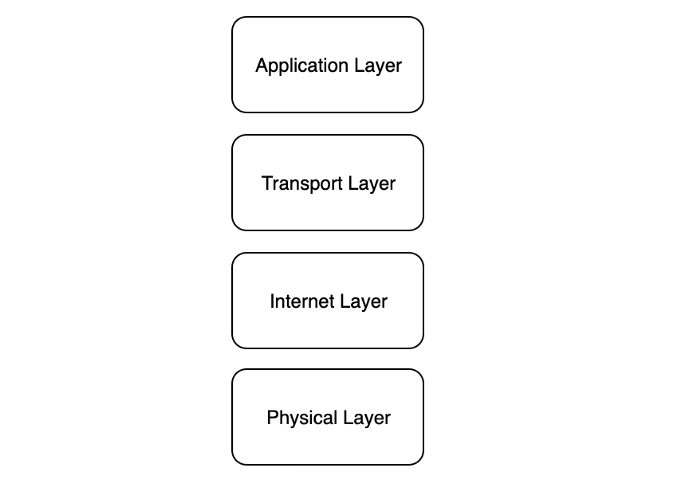
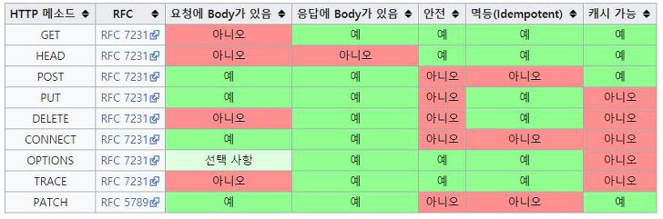

HTTP 프로토콜에 관한 내용 조사, 공부
==============================
### TCP/IP   

 * 응용계층: HTTP, FTP, Telnet, SMTP 등 네트워크를 사용하는 응용프로그램으로 이뤄집니다.
 * 전송계층: TCP, UDP 등 시스템을 연결하고 데이터를 전송하는 역할을 합니다.
 * 인터넷계층: ICMP, IGMP, IP등 데이터를 정의하고 데이터의 경로를 라우팅합니다.
 * 물리계층: Ethernet, ATM등 네트워크 하드웨어를 의미합니다
### HTTP 패킷
   클라이언트가 서버로 요청을 했을때, 보내는 데이터를 HTTP 패킷이라 표현한다.   
   HTTP 프로토콜을 쓰므로, 앞에 HTTP가 붙고 인터넷을 통해 보내는 데이터를 패킷이라 표현하므로,     
   HTTP패킷 이라 부른다. HTTP패킷의 구조는 크게 헤더 와 바디로 나뉘어진다.   
   헤더에는 7가지 HTTP 메서드 방식중 무엇을 썻는지, 클라이언트의 정보, 브라우저 정보,   
   접속할 URL 등등 과 같은 클라이언트 정보를 담는다.   
   바디는 보통 비어있다. 하지만, 특정 데이터를 담아서 서버에게 요청을 보낼 수 있다.   
   이러한 웹 개념아래, 우리는 GET메서드와 POST메서드를 통해서 요청을 할 수 있다.   

### HTTP 헤더?
   저장 되거나 전송되는 데이터 블록의 맨 앞에 위치한 데이터를 가리킵니다.
   특정 프로토콜의 헤더의 내용은 특정 프로토콜의 기능을 제공하기 위한 정보를 담고있습니다.
   헤더의 뒤에 이어지는 데이터는 페이로드 혹은 바디로 불립니다.
### HTTP 헤더의 역할
 > HTTP 헤더는 클라이언트와 서버가 요청 또는 응답으로 부가적인 정보를 전송할 수 있도록 해줍니다.
 
* #### General header

  요청 및 응답 메시지 모두에서 사용되지만 컨텐츠 자체에는 적용되지 않는 헤더.
  사용되고 있는 Context에 따라 response, request 헤더로 사용됩니다. 그러나 entity헤더는 아닙니다.
  가장 흔한 general 헤더는 Date, Cache-Control 및 Connection입니다.

   * Date : 현재시간
   * Pragma : 캐시제어(no-cahce), HTTP/1.0에서 쓰던 것으로 HTTP/1.1에서는 Cache-Control이 쓰인다.
   * Cache-Control : 캐시제어
   * Upgrade : 프로토콜을 업그레이드 HTTP/2.0
   * Via : 이용할 프록시의 이름, 프로토콜 버전, 호스트명
   * Connection : 전송이 완료된 후 연결을 유지할지 말지 나타냅니다. HTTP/1.1의 경우 keep-alive가 default입니다.
* #### Request header
  HTTP 요청에서 사용되지만 메시지의 컨텐츠와는 관련이 없는 헤더입니다.
  Accept, Accept-*, If-*와 같은 request 헤더 들은 조건부 요청 수행을 허용합니다.
  Cookie, User-Agent, Referer와 같은 다른 것들은 컨텍스트를 정확히 나타내어 서버가 응답에 맞출 수 있게 합니다.
  
   * Host : 서버의 도메인명과 서버의 포트를 지정합니다.
   
   * User-Agent : 클라이언트 정보를 포함합니다(예:브라우저 정보)
   
   * Referer : 현재 주소로 접근할 수 있었던 이전 주소의 정보를 포함합니다.
   
   * Accept : 클라이언트가 이해할 수있는 미디어 타입에 대한 정보를 포함합니다.
   
   * Accept-Charset : 클라이언트가 이해할 수 있는 캐릭터 셋에 대한 정보를 포함합니다.
   
   * Accept-Language : 클라이언트가 어떤 언어를 이해할 수 있는지, 그리고 locale중 어떤 것이 선호되는지에 대한 정보를 포함합니다.
   
   * Accept-Encoding : 클라이언트가 이해 가능한 컨텐츠 인코딩 방법에 대한 정보를 포함합니다.
   
   * Authorization : 클라이언트의 자격증명을 포함합니다.
   
   * Origin : fetch를 요청한 원래의 주소의 정보를 포함합니다. 경로 정보는 포함하지 않습니다.
   
   * Cookie : Set-Cookie헤더와 함께 서버에 의해 이전에 전송되어 저장된 쿠키를 포함합니다.
   
* #### Response header
  HTTP 응답에서 사용될 수 있는 헤더입니다. 역시 컨텐츠와는 관련이 없습니다.
  Age, Location, Server와 같은 response 헤더는 더 상세한 응답의 컨텍스트를 제공하기 위해 사용됩니다.
  
   * Transfer-Encoding : body 내용 자체 압축 방식 지정
      > Transfer-Encoding: chunked   
      > Transfer-Encoding: compress   
      > Transfer-Encoding: deflate   
      > Transfer-Encoding: gzip   
      > Transfer-Encoding: identity   
      > // 어떤 값들은 쉼표로 구분하여 나열될 수 있습니다   
      > Transfer-Encoding: gzip, chunked   

   * Expires : 응답의 유효기간을 설정합니다.
   
   * Last-Modified : 서버가 알고 있는 가장 마지막 수정 된 날짜와 시각을 표시합니다.
   
   * ETag : 특정 리소스를 식별하는 식별자. 컨텐츠가 변경되었는지 알 수 있습니다.
   
   * Set-Cookie : 서버에서 사용자 브라우저에 쿠키를 전송하기 위해 사용됩니다.
   
   * Location : 리다이렉트 될 주소에 대한 정보를 포함합니다. Status Code가 3xx 혹은 201일 경우에 볼 수 있다.
   
   * Server : 요청을 처리하는 서버의 소프트웨어 정보를 포함합니다.
   
   * Age : Max-Age의 시간 내에서 얼마나 흘렀는지에 대한 정보를 포함합니다.
   
   * WWW-Authenticate : 리소스에 접근하기 위해 사용되어야 하는 메소드에 대한 정보를 포함합니다. 401 Unauthorized 응답과 함께 전송됩니다.
* #### Entity header
  메시지 바디의 컨텐츠를 나타내는 헤더입니다.
  HTTP Request, Response 모두에서 사용됩니다.
  
   * Content-Encoding : 미디어 타입을 압축하기 위해서 사용됩니다. 클라이언트는 본문을 압축한 방식을 알 수 있습니다.
      > Content-Encoding: gzip   
      > Content-Encoding: compress   
      > Content-Encoding: deflate   
      > Content-Encoding: identity   
      > Content-Encoding: br   
      
   * Content-Type : 본문의 미디어 타입을 나타내기위해 사용됩니다.
   
   * Content-Length : 본문의 길이를 나타냅니다.
   
   * Content-Language : 본문이 대상으로 하는 언어를 의미합니다.
   
   * Content-Location : 컨텐츠에 접근할 수 있는 위치를 나타냅니다.
   
   * Allow : 리소스가 지원하는 메소드의 집합을 의미합니다.
   
### URL (Uniform Resource Locator)

 * URL이란
   인터넷 상의 자원의 위치
   특정 웹 서버의 특정 파일에 접근하기 위한 경로 혹은 주소
   
 * URL의 표현
   접근 프로토콜 :// IP 주소 또는 도메인 이름 (:포트번호) / 자원의 경로 / 자원의 이름
   > Ex) http://www.example.co.kr/test/index.html   
   > Ex) http://localhost:8080   
### HTTP Method
 * GET   
   GET 요청 방식은 URI(URL)가 가진 정보를 검색하기 위해 서버 측에 요청하는 형태이다
   > GET [request-uri]?query_string HTTP/1.1   
   > Host:[Hostname] 혹은 [IP]   
 
 * POST   
   POST 요청 방식은 요청 URI(URL)에 폼 입력을 처리하기 위해 구성한 서버 측 스크립트(ASP, PHP, JSP 등) 혹은 CGI 프로그램으로 구성되고 Form Action과 함께 전송되는데, 이때 헤더 정보에 포함되지 않고 데이터 부분에 요청 정보가 들어가게 된다. 
   > POST [request-uri] HTTP/1.1   
   > Host:[Hostname] 혹은 [IP]   
   > Content-Lenght:[Length in Bytes]   
   > Content-Type:[Content Type]   
   > [데이터] 
 
 * HEAD   
   HEAD 요청 방식은 GET과 유사한 방식이나 웹 서버에서 헤더 정보 이외에는 어떤 데이터도 보내지 않는다.
   웹 서버의 다운 여부 점검(Health Check)이나 웹 서버 정보(버전 등)등을 얻기 위해 사용될 수 있다. 
   > HEAD [request-uri] HTTP/1.1   
   > Host:[Hostname] 혹은 [IP]

 * OPTIONS
   해당 메소드를 통해 시스템에서 지원되는 메소드 종류를 확인할 수 있다. 
   > OPTIONS [request-uri] HTTP/ 1.1   
   > Host: [Hostname] 혹은 [IP]
 
 * PUT   
   POST와 유사한 전송 구조를 가지기 때문에 헤더 이외에 메시지(데이터)가 함께 전송된다.
   원격지 서버에 지정한 콘텐츠를 저장하기 위해 사용되며 홈페이지 변조에 많이 악용되고 있다.
   > PUT [request-uri] HTTP/1.1   
   > Host:[Hostname] 혹은 [IP]   
   > Content-Lenght:[Length in Bytes]   
   > Content-Type:[Content Type]   
   > [데이터] 
 
 * DELETE   
   원격지 웹 서버에 파일을 삭제하기 위해 사용되며 PUT과는 반대 개념의 메소드이다.
   > DELETE [request-uri] HTTP/1.1   
   > Host:[Hostname] 혹은 [IP]
 
 * TRACE   
   원격지 서버에 Loopback(루프백) 메시지를 호출하기 위해 사용된다.
   > TRACE [request-uri] HTTP/ 1.1   
   > Host: [Hostname] 혹은 [IP]
 
 * CONNECT   
   웹 서버에 프록시 기능을 요청할 때 사용된다.
   이 메소드는 요청한 리소스에 대해 양방향 연결을 시작하는 메소드다.
   CONNECT 메소드는 SSL(HTTPS)를 사용하는 웹 사이트 접속하는데 사용할 수 있다. 
   클라이언트는 원하는 목적지와 TCP연결을 HTTP 프록시 서버에 요청한다. 그러면 서버는 클라이언트 대신하여
   연결의 생성을 진행한다. 한번 서버에 의해 연결이 수립되면, 프록시 서버는 클라이언트에 오고가는
   TCP 스트림을 계속해서 프록시한다.
     
   > CONNECT [request-uri] HTTP/1.1   
   > Host:[Hostname] 혹은 [IP]
   
 * #### HTTP POST과 PUT의 차이
   POST는 보통 INSERT의 개념으로 사용되고, PUT은 UPDATE개념으로 생각하면 이해하기 쉽다. 
   또한 POST는 멱등하지 않고 PUT은 멱등하다. 
   즉, 동일한 자원을 여러번 POST 하면 서버자원에는 변화가 생기지만, 여러번 PUT하는 경우는 변화가 생기지 않는다.
   
   ###### 멱등(idempotent)의 의미는 같은 작업을 계속 반복해도 같은 결과가 나오는 경우를 의미한다. 동일한 자원에 대한 GET요청이라면 클라이언트에 반환되는 모든 응답은 동일해야 한다. 특정 자원에 대한 DELETE의 경우도 자원은 더이상 이용할 수 없어야 하며, DELETE요청을 다시 호출한 경우도 자원은 여전히 사용할 수 없는 상태여야 한다. 
   
   예를들어 POST의 경우 클라이언트가 리소스의 위치를 지정하지 않는 경우 사용된다. (/dogs)
   따라서, 아래와 같은 요청이 여러번 수행되는 경우 매번 새로운 dog가 생성되어 dogs/3, dogs/4 등 매번 새로운 자원이 생성된다. 멱등하지 않다는 말이다.
   > POST /dogs HTTP/1.1   
   > { "name": "blue", "age": 5 }   
   > HTTP/1.1 201 Created
   
   반면 PUT의 경우는 클라이언트가 명확하게 리소스의 위치를 지정한다. (/dogs/3)
   따라서, 아무리 많이 수행되더라도 리소스의 위치가 지정되어 새로운 자원이 생성되지 않으며 동일한 리소스(/dogs/3)를 수정하기 때문에 여러번 요청하더라도 멱등하다.
   > PUT /dogs/3 HTTP/1.1   
   > { "name": "blue", "age": 5 }
   
 * #### HTTP POST과 PUT의 차이
   PUT이 해당 자원의 전체를 교체하는 의미를 지니는 대신, PATCH는 일부를 변경한다는 의미를 지니기 때문에 최근 update 이벤트에서 PUT보다 더 의미적으로 적합하다고 평가받고 있다. 
   또한 PUT의 경우는 멱등하지만, PATCH의 경우는 멱등하지 않다. 
   PUT은 전체 자원을 업데이트 하기 때문에 동일 자원에 대해서 동일하게 PUT을 처리하는 경우 멱등하게 처리된다. 
   반면 PATCH로 처리되는 경우 자원의 일부가 변경되기 때문에 멱등성을 보장할 수 없다.

